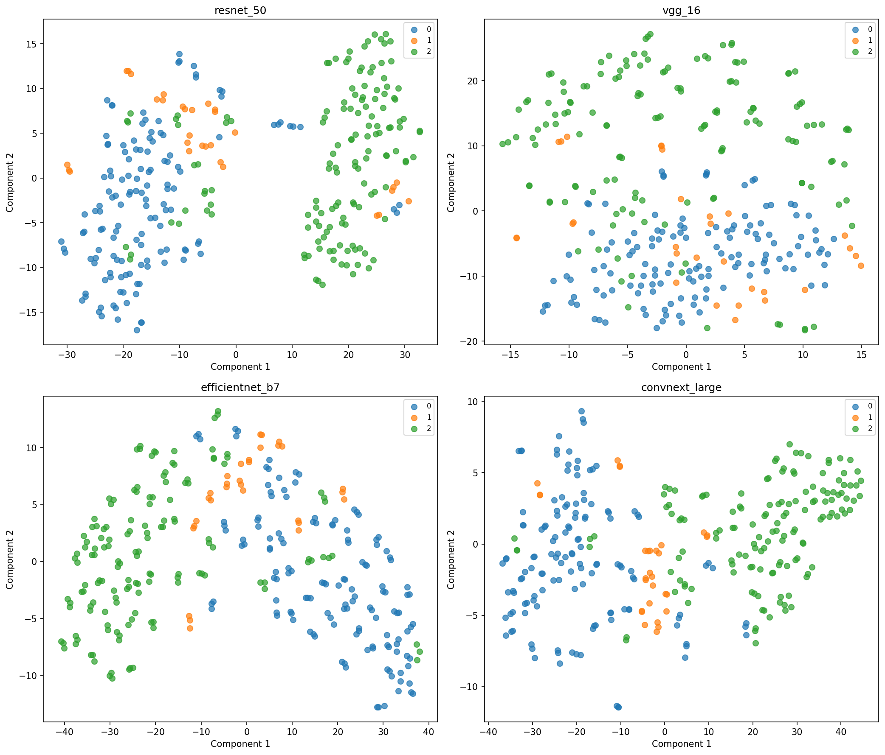

# Diabetic Retinopathy Classification on IDRiD

This repository contains an end-to-end deep learning pipeline for training, evaluating, and interpreting image classifiers on the IDRiD (Indian Diabetic Retinopathy Image Dataset). The project implements multiple CNN architectures (ResNet, EfficientNet, VGG, ConvNeXt) for automated classification of diabetic retinopathy severity levels.

## Features

- Dataset preprocessing and augmentation
- Training CNN-based classifiers with configurable hyperparameters
- Class-wise evaluation and error analysis
- Model explainability using Grad-CAM for visual inspection of predictions
- Feature map and embedding visualizations
- Reproducible experimentation with configurable training and inference scripts


## Setup

```bash
uv sync --all-groups --frozen
```

## Data Preparation

Download dataset from Kaggle [IDRID Dataset](https://www.kaggle.com/datasets/mohamedabdalkader/indian-diabetic-retinopathy-image-dataset-idrid)

```bash
uv run python3 scripts/download_dataset.py
```

## Train

```bash
cd src
uv run python train.py
```

## Test

```bash
cd src
uv run python test.py
```

## Inference

```bash
cd src
uv run python inference.py --model_name <model> --variant <variant> [--image_path <path> | --image_dir <dir>]
```

Example:
```bash
cd src
uv run python inference.py --model_name convnext --variant large --image_dir ../data/IDRiD/Test/images
```

## Visualization Scripts

### Grad-CAM Visualization

Generate Grad-CAM visualizations for model interpretability:

```bash
uv run python scripts/visualize_gradcam.py --model_name <model> --variant <variant> [--image_path <path> | --prediction_csv <path>]
```

Example:
```bash
uv run python scripts/visualize_gradcam.py --model_name convnext --variant large --prediction_csv src/test_predictions.csv
```

### Feature Maps Visualization

Visualize intermediate feature maps and layer evolution:

```bash
uv run python scripts/visualize_feature_maps.py --model_name <model> --variant <variant> [--image_path <path>]
```

Example:
```bash
uv run python scripts/visualize_feature_maps.py --model_name convnext --variant large
```

### Embeddings Visualization

Generate t-SNE embeddings visualization (modify script directly for different models):

```bash
uv run python scripts/visualize_embeddings.py
```

### Weights Distribution

Visualize weight distributions across model layers (modify script directly for different models):

```bash
uv run python scripts/visualize_weights.py
```

## Data Analysis

Data analysis is done in [notebooks/data_analysis.ipynb](notebooks/data_analysis.ipynb)

## Results

| Model              | Acc      | F1       | Prec     | Recall   | QWK      | Parameters |
|--------------------|----------|----------|----------|----------|----------|------------|
| ResNet-50          | 78.0     | 65.9     | 65.7     | 66.3     | 75.7     | 23.5M      |
| EfficientNet-B7    | 81.8     | 62.9     | 75.4     | 63.19    | 76.5     | 63.8M      |
| VGG-16             | 79.6     | 65.2     | 66.0     | 65.0     | 76.1     | 134.3M     |
| **ConvNeXt-Large** | **85.1** | **78.8** | **77.9** | **80.2** | **88.7** | 197.8M     |

### Embdding cluster on Macular Edema Risk Model



## Repository Structure

```text
retinal-disease-classification/
├── assets/                # Generated visualizations
├── data/                  # Dataset
├── notebooks/             # Jupyter notebooks for analysis
├── output/                # Training and evaluation results 
├── scripts/               # Visualization and utility scripts
├── src/
│   ├── dataloader/        # Data loading and preprocessing
│   ├── models/            # Model architectures
│   ├── trainer/           # Training utilities
│   ├── utils/             # Helper functions
│   ├── train.py           # Training script
│   ├── test.py            # Testing script
│   └── inference.py       # Inference script
```

## Disclaimer

This project is intended for research and educational purposes only. The models and predictions generated by this code are not intended for clinical use or medical diagnosis. Always consult qualified healthcare professionals for medical advice and diagnosis. The authors and contributors are not responsible for any decisions made based on the outputs of this software.

## Credits

This project uses the IDRiD (Indian Diabetic Retinopathy Image Dataset) available on Kaggle.

- [Indian Diabetic Retinopathy Dataset on Kaggle](https://www.kaggle.com/code/mohamedabdalkader/indian-diabetic-retinopathy)
